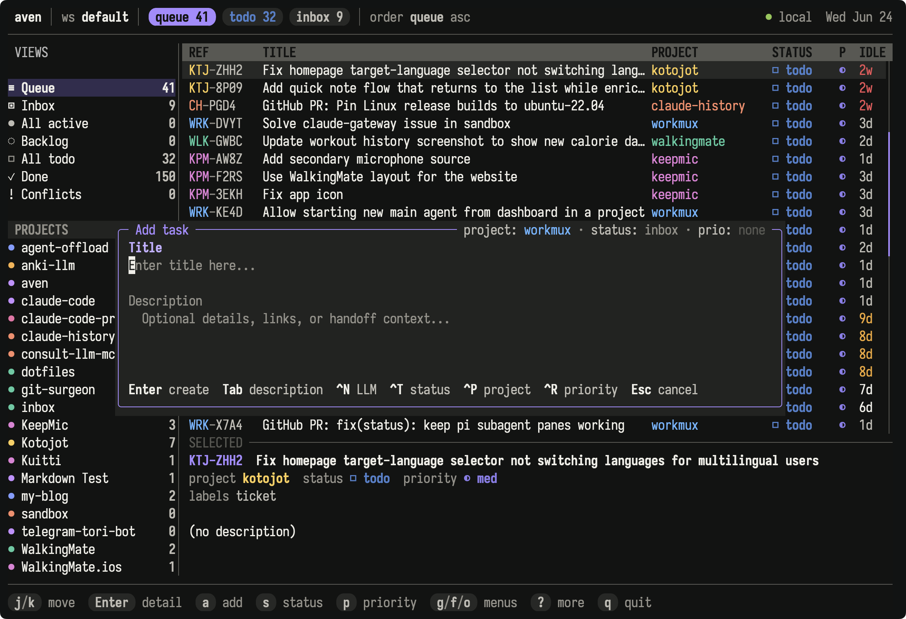

# aven

`aven` is a task manager for humans and coding agents. It is my attempt to build
the perfect personal, power-user task system for myself.

It came from a few specific needs:

- one overview across many projects (what should I do next?)
- task capture from anywhere (e.g. voice message to an agent in messaging app)
- first-class coding-agent workflows
- workspace isolation for personal and work tasks
- power user ergonomics (e.g. easily add a new task from a tmux popup)

## Why aven?

- **Offline-first, repo-independent storage.** Tasks live in a local SQLite
  database, not in tracked files inside each repo. One task store can span
  projects and devices, with optional self-hosted sync when you want tasks
  reachable from anywhere.

- **Projects map to repos.** Each repository becomes a project by default,
  created on demand when you add its first task.

- **Agent-first CLI, human-first TUI.** Agents get token-efficient output,
  explicit task refs, and ergonomic commands for scripted updates. Humans get a
  keyboard-first TUI with project views, filters, sorting, detail view, undo,
  and command palette.

- **Stable task refs.** Stable, unique Jira/Linear-style refs like `APP-7KQ9`
  work offline and show the task's project at a glance.

- **Workspaces are first class.** Personal and work tasks can share the same
  tool without sharing the same visible task universe. Simply configure that
  everything under `~/work` belongs to the `work` workspace.

- **Markdown-native tasks.** Tasks can carry Markdown descriptions and
  append-only notes, so context stays with the task.

- **Fast capture from anywhere.** Comes with LLM-powered natural-language task
  intake and tmux popup capture.

Inspired by Taskwarrior. See [Why not Taskwarrior?](#why-not-taskwarrior).



## Quick start

Install the binary globally from a local checkout:

```sh
cargo install --path .
```

Create a config file:

```sh
aven config init
```

Open the TUI:

```sh
aven tui
```

## Agent workflow

`aven` is designed so agents can use the CLI without guessing hidden state.

Start with:

```sh
aven prime
```

That prints the agent primer plus open issues for the inferred project. Use an
explicit project when inference is wrong:

```sh
aven prime --project app
```

Core commands:

```sh
aven list --project app
aven list --status todo
aven list --deleted
aven show APP-7KQ9 --full
aven add "fix conflict display" --project app --priority high --label bug
aven add --natural "fix conflict display and assign it to app"
aven update APP-7KQ9 --status active
aven note APP-7KQ9 "durable handoff context"
aven delete APP-7KQ9
aven restore APP-7KQ9
```

Guidelines for agents:

- Prefer refs printed by command output, such as `APP-7KQ9`.
- Use `show --full` before decisions that depend on descriptions, labels, notes,
  deletion state, or conflicts.
- Use `--description-file`, `--description-stdin`, `note --file`, or
  `note --stdin` for long Markdown.
- Use `bulk-update --dry-run` before broad mutations.
- Do not put secrets in titles, descriptions, labels, projects, notes, or logs.

## Sync

Local commands write directly to SQLite. Sync is optional.

Start a local test server:

```sh
aven server --bind 127.0.0.1:0 --data /tmp/aven-server.sqlite
```

Sync a client:

```sh
aven sync --server http://127.0.0.1:<port>
```

Run the background daemon for the configured local database:

```sh
aven daemon
```

On macOS, install it as a user LaunchAgent:

```sh
aven daemon install
aven daemon uninstall
```

The daemon wakes after successful local mutations when possible and also syncs
periodically while it is running.

Current sync limits:

- v1 sync is an HTTP/JSON operation log, not a CRDT.
- v1 supports one configured sync server per local database.
- Conflict resolution is explicit and field based.
- Plain HTTP is intended for loopback, trusted VPNs, private networks, or TLS
  termination you provide externally.

## tmux capture

Open a tmux popup for fast task capture:

```sh
aven tmux add-task-popup
```

Print a binding you can add to your tmux config:

```sh
aven tmux add-task-popup --print-binding
```

## Why not Taskwarrior?

I built this to replace Taskwarrior for me. Taskwarrior is great but obviously
it was not originally designed around coding agents as first-class users.

- Task ids need to be stable, short, and visible in normal command output. UUIDs
  are ugly.
- Taskwarrior's CLI tries to be the human interface, which makes it unergonomic
  for agents to work with. I want the CLI to primarily be an agent interface,
  and the TUI to be optimized for humans. Everything should be easier through
  TUI than CLI for humans.
- Tasks need first-class Markdown descriptions and notes, not just references to
  sidecar files that only exist on one machine, which is the Taskwarrior way.
- Workspaces should be part of the model, so personal and work tasks can be
  isolated without shell aliases or database juggling.
- There is no adequate TUI, or GUI in general.

Rather than adding hacks on top of Taskwarrior, I want to own the full stack and
make my own task manager. AI coding makes that reasonable side project instead
of a fantasy.
