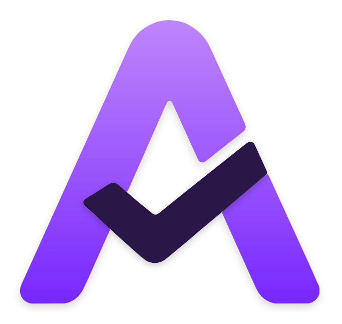
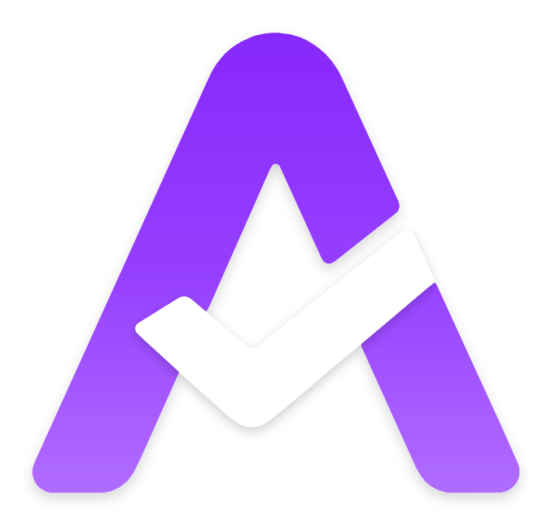
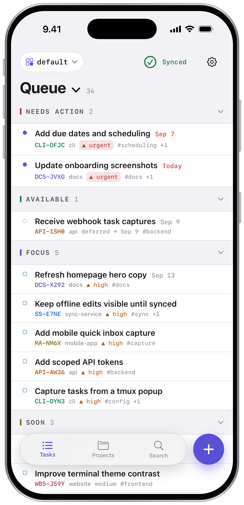
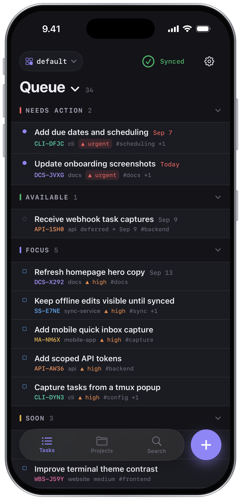

<h1>
  <a href="https://aven.raine.dev#gh-light-mode-only"></a>
  <a href="https://aven.raine.dev#gh-dark-mode-only"></a>
  aven
</h1>

`aven` is a local-first task manager for power users and agents. It gives you one overview across
projects, task capture from wherever work appears, first-class agent workflows, workspace isolation,
and a polished terminal UI.

It is currently under active development, but already works really well and I use it as my daily
driver.

If you've tried aven, feedback is welcome! Please
[open an issue](https://github.com/raine/aven/issues) to share it.

If you find aven useful, consider sharing it with others who might benefit from it.

Docs: <https://aven.raine.dev>

<p>
  <a href="meta/tui.webp"></a>
  <a href="meta/ios-light.webp#gh-light-mode-only"></a>
  <a href="meta/ios-dark.webp#gh-dark-mode-only"></a>
</p>

*Your tasks, away from the terminal. Aven for iOS is coming soon.*

## Why aven?

The CLI is agent-first, while the [power-user TUI](https://aven.raine.dev/tui/) gives humans a
keyboard-driven path to every action.

The [queue view](https://aven.raine.dev/concepts/#queue) brings together tasks from every project
and shows what needs action, what is blocked, and what to focus on next.

Aven keeps tasks in a local SQLite database instead of tracked files inside each project repo. You
and your agents can capture and update tasks offline, independent of git state, branches, worktrees,
or checkouts. If you need the same tasks on more than one device, you can
[sync them through a server you control](https://aven.raine.dev/sync/).

Repositories map to projects by default. Aven creates a project when you add its first task, and
gives each task a short Jira/Linear-style ID such as `APP-7KQ9`. Aven can generate them without a
server connection, and the project prefix shows where each task belongs.

[Workspaces](https://aven.raine.dev/organize-tasks/#separate-work-with-workspaces) keep personal and
work tasks in separate views while sharing one database. You can map a directory such as `~/work` to
a workspace. When you run aven from that directory, it selects the workspace automatically.

Markdown descriptions, append-style notes, and
[image attachments](https://aven.raine.dev/tui/#image-attachments) keep task context available to
you and your agents. Copy a complete task report as Markdown or
[publish it as an unlisted GitHub gist](https://aven.raine.dev/tui/#publish-a-task-report-as-a-github-gist)
when you want to share that context. You can capture work through natural-language input, a tmux
popup, or agent-friendly commands, then schedule it to appear when it needs your attention.

Inspired by Taskwarrior. See [aven and Taskwarrior](https://aven.raine.dev/taskwarrior/).

## Quick start

Install with the release script:

```sh
curl -fsSL https://raw.githubusercontent.com/raine/aven/main/scripts/install | bash
```

Or install with Homebrew:

```sh
brew install raine/aven/aven
```

Open Aven:

```sh
aven tui
```

Or try the demo:

```sh
aven demo
```

Every demo run starts from the same sample data, and changes are discarded on exit.

See [Getting started](https://aven.raine.dev/getting-started/) for first-run usage.

## Documentation

- [What is aven?](https://aven.raine.dev/)
- [Getting started](https://aven.raine.dev/getting-started/)
- [Concepts](https://aven.raine.dev/concepts/)
- [Using the TUI](https://aven.raine.dev/tui/)
- [Organizing tasks](https://aven.raine.dev/organize-tasks/)
- [Scheduling tasks](https://aven.raine.dev/schedule-tasks/)
- [Recurring tasks](https://aven.raine.dev/recurring-tasks/)
- [Work with agents](https://aven.raine.dev/agents/)
- [Sync across devices](https://aven.raine.dev/sync/)
- [Back up and restore](https://aven.raine.dev/backups/)
- [Command reference](https://aven.raine.dev/command-reference/)
- [Configuration](https://aven.raine.dev/configuration/)
