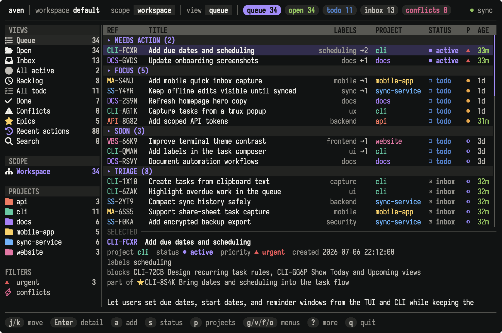

# aven

`aven` is a local-first task manager for humans and coding agents. It is built as
a personal, power-user task system: one overview across projects, task capture
from wherever work appears, first-class agent workflows, workspace isolation,
and a polished terminal UI.

Docs: <https://aven.raine.dev>



## Why aven?

- **Offline-first, repo-independent storage.** Tasks live in a local SQLite
  database, not in tracked files inside each repo. Task capture and agent updates
  stay independent from git state, branches, worktrees, and checkouts.

- **Optional self-hosted sync.** Keep the local-first workflow and make the same
  tasks available across laptops, agents, and other devices through a server you
  control.

- **Projects map to repos.** Each repository becomes a project by default,
  created on demand when you add its first task.

- **Agent-first CLI, human-first TUI.** Agents get token-efficient output, stable
  refs, and commands for capturing follow-up work, updating tasks, and preserving
  context from AI coding agents. Humans get a polished, keyboard-first TUI with
  project views, filters, sorting, task detail, undo, mouse support, and command
  palette.

- **Stable task refs.** Stable, unique Jira-style refs like `APP-7KQ9` work
  offline and show the task's project at a glance.

- **Workspaces are first class.** Personal and work tasks can share the same tool
  without sharing the same visible task universe.

- **Markdown-native tasks.** Tasks carry Markdown descriptions and append-style
  notes, so context stays with the task.

- **Fast capture from anywhere.** Natural-language task intake, tmux popup
  capture, and agent-friendly commands make it easy to add tasks.

Inspired by Taskwarrior. See
[aven and Taskwarrior](https://aven.raine.dev/taskwarrior/).

## Quick start

Install with the release script:

```sh
curl -fsSL https://raw.githubusercontent.com/raine/aven/main/scripts/install | bash
```

Or install with Homebrew:

```sh
brew install raine/aven/aven
```

Open the TUI:

```sh
aven tui
```

See [Getting started](https://aven.raine.dev/getting-started/) for first-run
usage.

## Documentation

- [What is aven?](https://aven.raine.dev/)
- [Getting started](https://aven.raine.dev/getting-started/)
- [Concepts](https://aven.raine.dev/concepts/)
- [Configuration](https://aven.raine.dev/configuration/)
- [TUI](https://aven.raine.dev/tui/)
- [Agents](https://aven.raine.dev/agents/)
- [Sync and backups](https://aven.raine.dev/sync/)

